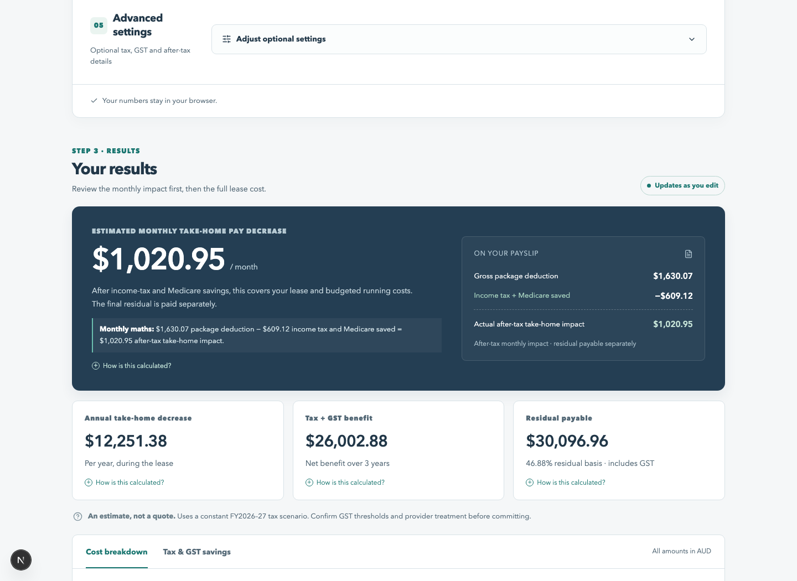

# Novate — Australian novated lease calculator



Novate is a client-side Australian novated lease calculator. It answers the practical question: **how much will the lease reduce my take-home pay, and what will I pay in total, including the residual?**

Built with Next.js 16.3.5, React 19.3, strict TypeScript, and Tailwind CSS 4. The interface is available in English and Simplified Chinese. No database, authentication, API keys, or calculation backend is used, and input data stays in the browser.

## What it does

Enter the vehicle, salary, lease, and running-cost assumptions to get an estimate that updates as you edit. The page keeps the flow in one readable sequence:

1. Complete the inputs, grouped by vehicle, salary, lease, life on the road, and advanced settings.
2. Review the monthly take-home impact, annual decrease, tax and GST benefit, and residual payable.
3. Compare the same scenario across one- to five-year lease terms.
4. Inspect the lean calculation ledger, with the formulas, substituted values, and results shown as math.

The calculator supports battery-electric, plug-in hybrid, and petrol vehicles, progressive income tax, Medicare, GST, FBT/employee contributions, English/Chinese translation, reset-to-demo defaults, keyboard navigation, and responsive desktop/mobile layouts. It is an estimate rather than a quote or personal tax, financial, or legal advice.

## GitHub Pages deployment

This repository is configured for static GitHub Pages deployment:

- `next.config.ts` enables Next.js static export and writes the deployable site to `out/`.
- `.github/workflows/deploy.yml` installs Node.js 24, runs lint/type/unit checks, builds the export, and deploys it on pushes to `master` or `main`.
- The workflow passes GitHub Pages' repository base path to Next.js, so project pages work at a URL such as `https://lihan.github.io/novated_car_lease_calculator/`.

To enable it in GitHub:

1. Push this repository to GitHub.
2. Open **Settings → Pages** and set **Source** to **GitHub Actions**.
3. Push to `master` or `main`, or run **Deploy static site to GitHub Pages** manually from the Actions tab.
4. Open the published URL shown by the workflow's `github-pages` environment.

The export contains no server or API dependency; the calculator runs in the browser after the static page loads. See the [Next.js static export guide](https://nextjs.org/docs/app/guides/static-exports) and [GitHub Pages deployment guide](https://docs.github.com/en/get-started/start-your-journey/deploying-your-website-automatically) for the platform details.

## Architecture

```text
src/
  app/                       Next.js layout, metadata, route, Tailwind/styles
  components/
    calculator.tsx           Input state, memoised engine calls, result rendering
    number-field.tsx         Draft typing and last-valid numeric value
    working.tsx              Shared structured explanation renderer
  i18n.ts                    English/Chinese UI and calculation-copy translations
  calculator/
    types.ts                 Inputs, rule contracts, steps and sections
    defaults.ts              Demo scenario, not regulatory rules
    validation.ts            Input validation and currency parser
    tax.ts                   Progressive resident tax and LITO
    medicare.ts              Independent individual/family levy calculation
    gst.ts                   Purchase components and ordinary GST credit cap
    fbt.ts                   EV eligibility classification
    lease.ts                 Residual and balloon finance
    running-costs.ts         Electricity, fuel, expense and GST budgets
    take-home.ts             Before/after salary cash flows
    scenario.ts              Central orchestration, savings, totals, working
    comparison.ts            Independent after-tax and lease-term comparison helpers
    explanations.ts          Shared step/section construction
  rules/
    tax/2026-27.ts            Resident tax, Medicare, ordinary GST configuration
    fbt/2026.ts               Current eligibility vs separate proposed measures
    lease/ato-residuals.ts    Central residual table and source metadata
    index.ts                 Active rules and legislated-only guard
  utils/format.ts             AUD, percentages and display formatting
  tests/calculator.test.ts   Financial and state-transition unit tests
e2e/calculator.spec.ts        Browser interaction and responsive tests
```

Financial modules do not import React, access the network or mutate inputs. `calculateNovatedLeaseScenario(inputs, rules)` returns the normalized inputs, rules, lease, residual, GST, running expenses, tax/Medicare before and after, salary packaging, savings, take-home impact, total cost, warnings and 21 explanation sections. The UI formats and renders these objects.

### Real-time and explanation design

Every valid input change immediately updates React state. A memoised synchronous call calculates the current scenario. There is no debounce, submit step or calculation request.

Numeric inputs keep their raw editing string separately from the last accepted value. Empty, negative or incomplete strings such as `$70,` show a field message and preserve the previous scenario. Completed formatted currency is accepted. Cross-field validation keeps the last accepted scenario and shows a form-level message.

Each `CalculationStep` contains numeric inputs, presentation values, a readable formula, substituted calculation, raw result and formatted result. Inline explanations, the 1–5-year lease-term simulation and headline cards use the same engine values. The final working ledger shows every section as a concise formula → substituted calculation → result line. The language switcher translates the visible interface and working labels while leaving calculation data and formulas untouched. Currency is rounded only for display; inline explanations retain an **Unrounded values** disclosure. An approximation sign makes cent-rounding explicit. Tiny differences from manually recomputing rounded substitutions are not hidden.

## Financial methodology

### 1. Purchase price and GST

Simple mode treats car price as GST-inclusive vehicle expenditure. Advanced mode adds GST-inclusive dealer charges and separately adds non-GST registration, stamp duty and other charges. Do not enter the same on-road amount twice.

For a GST-inclusive eligible expense:

```text
GST component = amount × GST rate / (1 + GST rate)
              = amount / 11 at 10% GST
Vehicle credit = min(included vehicle GST, ordinary credit cap)
Amount financed = complete purchase price − recoverable acquisition GST
```

The requested **$69,883 car limit and $6,353 maximum ordinary GST credit** are configured for FY2026–27. These values were supplied in the project brief; the primary ATO threshold page could not be retrieved for independent verification. The app and rule metadata explicitly disclose this. `lastVerified: null` is intentional, not a claim of verified thresholds. Confirm them before a public financial release.

The model assumes a GST-registered employer and that eligible rental GST is fully recoverable. Rental invoice GST and its matching credit cancel; a second rental-GST “saving” is never added. Luxury car leasing or restricted employer entitlement may require different treatment and must be confirmed in a quote.

Running-cost GST is calculated per component. Registration and CTP are conservatively treated as non-GST in this estimate. Insurance has a separate non-GST duties/levies input. Servicing and tyres are assumed GST-bearing. Other expenses require an eligibility switch. The BEV demo makes **no electricity GST claim**; use the switch only with eligible substantiation. Administrative fees are entered inclusive of GST.

The demo defaults use a $150,000 salary, $3,000 annual insurance, $84 annual registration, $632 annual CTP, $200 annual servicing, a $31 monthly administration fee and an 11% effective lease interest rate. The electricity-price helper suggests $0.55/kWh for an average public charger and $0.08–$0.30/kWh for home charging.

### 2. Residual and finance

The central residual table uses the eight-year-effective-life car percentages from [ATO TD 93/142](https://www.ato.gov.au/law/view/document?DocID=TXD/TD93142/NAT/ATO/00001): 65.63%, 56.25%, 46.88%, 37.50%, 28.13% for one through five years.

```text
Residual ex GST = amount financed × term residual percentage
Residual GST = residual ex GST × 10%
Final private payout = residual ex GST + residual GST
```

**Cost-basis assumption:** the financed amount, including unrecovered acquisition GST and financed on-road charges, is the residual basis. Lessor contracts can use a different eligible asset-cost basis; confirm the quoted residual rather than treating this estimate as a binding payout. The ATO percentages are minimum guidance, not a forecast resale value.

For monthly payments in arrears:

```text
P = amount financed
R = residual excluding GST
r = entered annual percentage / 100 / 12
n = years × 12
PV residual = R / (1 + r)^n
Monthly payment = (P − PV residual) × r / (1 − (1 + r)^(-n))
At zero interest: monthly payment = (P − R) / n
Interest = all monthly payments + R − P
```

The user-facing label is **Effective lease interest rate**, as requested. Its convention here is the annualised monthly rate in the specified balloon formula, not an effective annual yield or a comparison rate. `log1p`/`expm1` avoid cancellation for very small rates. Rates outside 7–12% are accepted with a warning; numerical validation permits up to 1,000%.

### 3. Running expenses

```text
EV kWh/year = annual km × kWh/100km / 100
EV cost/year = kWh/year × electricity price
Fuel litres/year = annual km × L/100km / 100
Fuel cost/year = litres/year × fuel price
Annual running budget = energy + insurance + registration + CTP + servicing + tyres + other
Net package budget = gross running budget − eligible running GST credits
```

PHEV mode uses a disclosed fuel-only approximation; it does not model a mixed petrol/electric split. Annual registration is recurring expenditure; purchase registration is a separate initial vehicle charge. Users should adjust budgets to avoid overlap in the first registration period.

### 4. EV exemption and employee contributions

Eligibility uses the vehicle type, first-held-and-used date, lease commencement date and declared historical LCT liability. See the [ATO electric cars exemption](https://www.ato.gov.au/businesses-and-organisations/hiring-and-paying-your-workers/fringe-benefits-tax/types-of-fringe-benefits/cars-and-fbt/electric-cars-exemption).

A BEV is **likely exempt** only if the required facts are supplied, first use is on/after 1 July 2022, and LCT has never been payable. The model assumes a qualifying passenger car provided to a current employee. A low current sale price alone cannot establish the historical LCT position.

New PHEV commitments on/after 1 April 2025 are not exempt. Earlier PHEV agreements require individual assessment of transitional conditions and return **Unable to determine**. Missing data and inconsistent dates do not imply exemption.

Non-exempt and undetermined cases use a clearly labelled full-year statutory employee contribution estimate:

```text
Annual employee contribution (ECM, GST inclusive) = GST-inclusive FBT car base × 20%
Contribution output GST = ECM / 11
Requested pre-tax deduction = max(0, net expense budget − ECM + contribution GST)
Actual pre-tax deduction = min(salary, requested pre-tax deduction)
After-tax deduction = ECM + any package amount unfunded by salary
```

The FBT base includes vehicle and dealer charges, excluding the separately entered registration and duties. The model assumes full-year private availability, no business-use adjustment, no operating-cost method and no later base-value reduction. Excess contributions above package cost are conservatively retained as a cost and prominently flagged; this is a case for a tailored provider quote, not an assumed refund.

### 5. Income tax and Medicare

Resident tax is computed progressively at 0%, 15%, 30%, 37% and 45%, with thresholds of $18,200, $45,000, $135,000 and $190,000. The full calculation is performed at salary before and after eligible pre-tax deductions. Each band appears in the working. No marginal-rate multiplication shortcut is used.

The non-refundable low income tax offset (LITO) is included: maximum $700, tapering by 5% above $37,500 up to $45,000, then 1.5% thereafter until exhausted. Other offsets/deductions are excluded.

Sources: [Income Tax Rates Act 1986](https://www.legislation.gov.au/C2004A03348/2026-07-01/text), [LITO — ITAA 1997 s61-110](https://www.ato.gov.au/law/view/document?docid=PAC/19970038/61-110).

Medicare is separate. The [Medicare Levy Act compilation effective 1 July 2026](https://www.legislation.gov.au/C2004A03351/2026-07-01/text) provides a 2% rate, individual threshold $28,011, 10% phase-in and upper limit $35,013. Family calculations apply the $47,238 threshold plus $4,338 per eligible dependent child, including statutory spouse allocation and unused reduction transfer. Select family status for an eligible sole parent. This does not cover SAPTO, part-year exemptions or changing family circumstances.

**HELP repayments and Medicare levy surcharge are not calculated.** Advanced settings make this explicit and surface prominent warnings when relevant. Reportable fringe benefits can affect HELP, surcharge and other income tests even where the car is FBT exempt. Do not infer that a taxable-salary reduction reduces every obligation.

### 6. Take-home pay and total cost

```text
Take-home before = salary − income tax before − Medicare before
Take-home after = salary − pre-tax deduction − post-tax deduction
                  − income tax after − Medicare after
Annual decrease = take-home before − take-home after
Monthly decrease = annual decrease / 12
Total out-of-pocket = annual decrease × years + final residual including GST
                      + additional after-tax upfront/end costs
Effective monthly vehicle cost = total out-of-pocket / lease months
```

Salary-packaged finance, interest, administration and running costs are **already in the take-home decrease**. They are not added again. Acquisition GST has already reduced borrowing and is not subtracted again. Negative take-home pay or salary shortfalls are flagged as unaffordable scenarios, not treated as approved packaging arrangements.

The car is retained after the final payout. No resale proceeds, depreciation estimate, opportunity cost, deposit, trade-in, separate personal-finance fees or early-termination forecast is included. This is cash outlay, not economic cost after resale.

### 7. Benefits and accounting checks

Income-tax savings are attributed sequentially to finance/administration, energy, then other running costs. Each increment runs through progressive tax. ECM and unfunded deductions are allocated proportionally across the cost categories. Attribution order affects component labels, never the total. Medicare is shown separately.

```text
Whole-lease tax saving = (annual income-tax saving + annual Medicare saving) × years
Net GST benefit = acquisition credit
                  + (annual running credits + admin credits − ECM output GST) × years
                  − residual purchase GST
Total tax + GST benefit = whole-lease tax saving + net GST benefit
```

The after-tax comparator finances the **gross purchase price**, using the same rate, term and final GST-inclusive balloon, and pays the same gross running expenses and administration from after-tax salary. Matching the balloon isolates packaging cash flows. This is not a cash purchase or an alternative market loan quote.

```text
Novated advantage = equivalent after-tax out-of-pocket − novated out-of-pocket
                 = tax + net GST benefit + finance-interest difference
                   − any excess employee contributions
```

Tests verify this identity for exempt EV, ECM, unknown eligibility, low salary, zero interest, non-GST on-roads and all lease terms. The page presents one selected lease scenario, a 1–5-year simulation table and a fully expanded calculation ledger as the final stage of the flow; comparison helpers remain independently testable outside that primary flow.

## Rule versions and updates

Every rule configuration carries its financial year, source, URL, verification date and legislated/proposed status. The active-rule guard rejects proposed rules and mixed financial years. Proposed EV measures are a separate metadata record and never enter the main calculation.

**This release is a constant FY2026–27 scenario projection.** It intentionally holds the tax snapshot, income, prices and FBT treatment constant across every lease year. It does not claim to apply future tax cuts, future threshold indexation or future FBT reforms. Even already announced/legislated future-year changes require their own rule files before a calendar-aware projection can be offered. Lease dates inform EV eligibility; they do not prorate salary deductions or FBT days.

To update:

1. Read the primary legislation/ATO source and confirm effective dates, transitional conditions and current status.
2. Add a new rule module, preserving historical versions. Record exactly what was verified and when; never copy a verification date without checking.
3. Update the active rule set, metadata links and assumptions together. Keep proposals separate.
4. Add boundary tests, independent worked examples and whole-scenario reconciliation cases before activation.
5. Run the complete check suite, including live browser tests. Obtain specialist review before presenting a new tax treatment as reliable financial guidance.

## Verification

- 133 unit tests cover requested defaults, tax band edges, bracket-crossing deductions, LITO, individual/family Medicare, annual and monthly residual rates, independent balance amortisation, zero/near-zero interest, electricity/fuel, CTP, GST caps, input validation, FBT dates, proposed-rule rejection and accounting identities.
- 22 browser tests exercise initial engine/render agreement, the top-to-bottom input/result order, the 1–5-year simulation table, live edits, incomplete input retention, reset with updated defaults, English/Chinese switching without result changes, the fully visible working ledger, duration selection, advanced warnings, fuel switching and horizontal-overflow checks at desktop/mobile sizes.
- The production build prerenders the page; interactivity then runs in the browser.
- Source verification is deliberately distinct from software verification: tests passing cannot certify an unverified regulatory threshold or a provider's contract.

This calculator is an estimation tool, not personal tax, financial or legal advice.

## Run locally

Use Node.js 24 (the version in `.nvmrc`), then install dependencies and start the development server:

```bash
npm ci
npm run dev
```

Open [localhost:3000](http://localhost:3000). To verify the static export locally, run `npm run build`; the generated site is written to `out/`.
